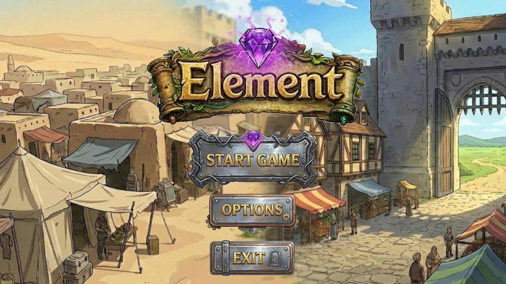
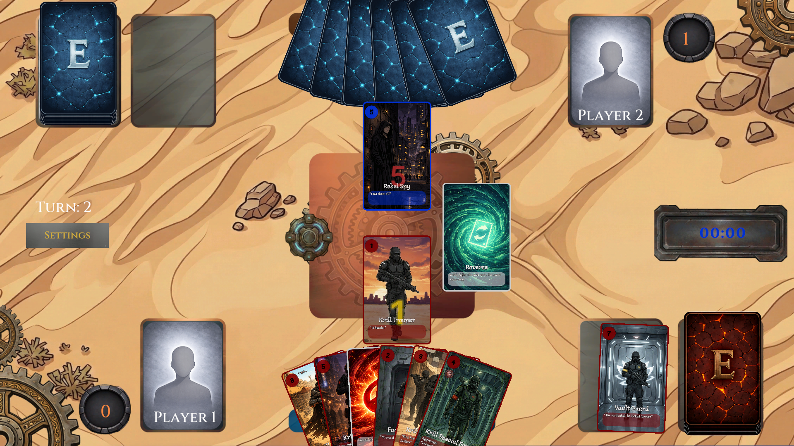
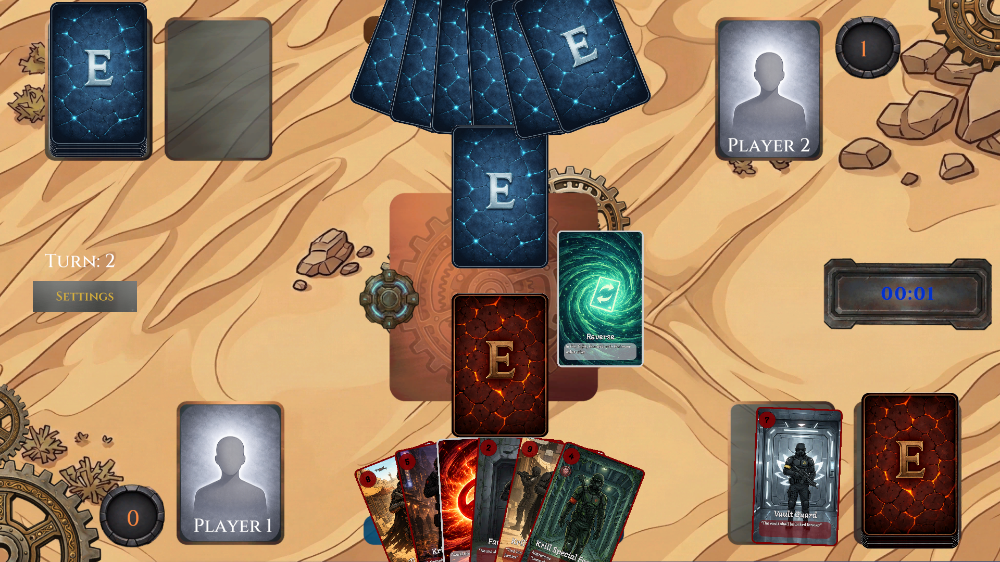
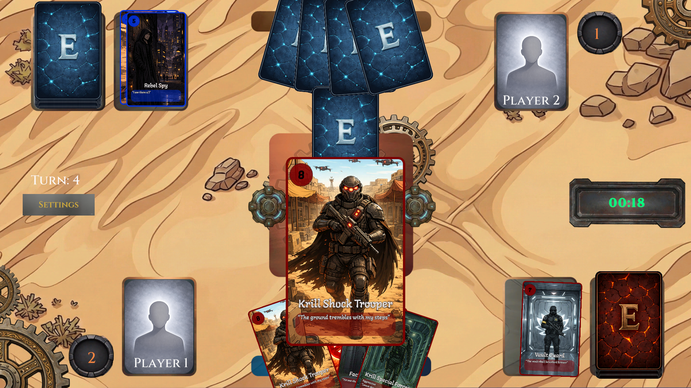
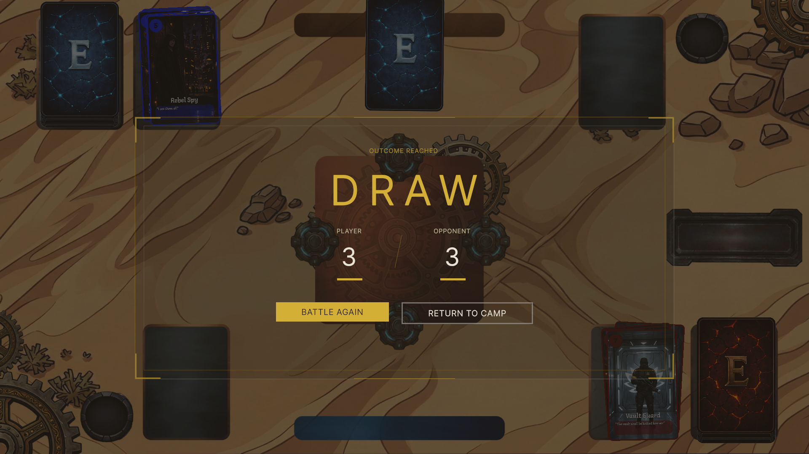

  
# 🌪️ Element: A Strategic Card Battler

**Developed by Guy | Bigfoot Studios**

## 📖 Overview
**Element** is a strategic card game built in **Unity** that challenges players to master elemental synergies. This project serves as a comprehensive showcase of custom UI systems, modular card architecture, and turn-based game logic.

### ✨ Core Features
- **Elemental Synergy:** Unique interactions between card types (Fire, Water, Earth, Air).
- **Dynamic UI:** A custom-built interface designed for intuitive drag-and-drop gameplay.
- **Modular Card System:** Data-driven card creation using ScriptableObjects.

---

## 🎮 Gameplay Demo

Experience the dynamic turn-based combat and elemental interactions in action:

<video src="media/Video.mp4" controls="controls" width="100%"></video>

---

## 📸 Visual Showcase

Explore the game's intuitive interface, custom card design, and battle arenas.

  
  

 

  
  

 

  

### 🎨 Asset Design
- **Custom Elements:** Card frames and icons were meticulously designed to reflect a cohesive, mystical aesthetic.
- **Real-Time UI Feedback:** Clear visual cues to indicate valid moves, active effects, and turn states.

---

## 🛠️ Technical Implementation
This project was developed with a focus on clean architecture and maintainability, demonstrating several key game development patterns:

- **State Machine Logic:** Robust management of complex turn-based transitions (Draw &rarr; Main &rarr; Combat &rarr; End).
- **ScriptableObjects:** Streamlined data-driven design for card balancing and the addition of new elemental cards without altering core logic.
- **Event-Driven Architecture:** Utilized C# Actions/Events for UI updates, ensuring gameplay logic remains entirely decoupled from the view layer.
- **Hand Management:** Custom algorithms for dynamic card spacing, rotation, and selection logic within the player's hand.

---

## 👨‍💻 About the Developer

I am a Computer Science student at **Reichman University** with a passion for game development and martial arts. **Element** is a culmination of my deep interest in strategic logic, interactive systems, and clean software design.

**[Guy](https://github.com/guy)**  
*Creating engaging experiences at Bigfoot Studios*

